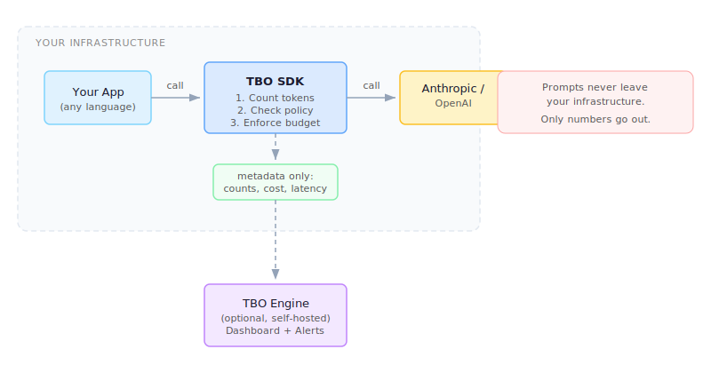

# Token Budget Orchestrator (TBO)

[](https://pypi.org/project/token-budget-orchestrator/)
[](https://www.npmjs.com/package/token-budget-orchestrator)
[](https://github.com/ricmmartins/tokenbudgetorchestrator/actions)
[](LICENSE)

Most LLM observability tools (Helicone, Langfuse, Datadog) show you what already happened. You find out about the budget blowout at the end of the month. TBO sits between your code and the LLM provider and makes decisions *before* each call: is the agent over budget? Should the call be routed to a cheaper model? Should it be blocked entirely?

## Why this exists

Multi-agent systems burn tokens in ways that are hard to predict. Agent-to-agent communication alone generates 3-5x more tokens than a single-agent workflow doing the same job. I kept seeing teams run multi-agent pipelines without any guardrails, then scramble when the invoice came.

TBO gives you a budget per agent with automatic enforcement, so one runaway agent cannot drain the whole project.

## What it does

- Set token or cost limits per agent, per project, or per user. Resets happen automatically (hourly, daily, weekly, monthly).
- Define routing rules: send drafts to Haiku ($0.25/M tokens), send reviews to Sonnet, send final QA to Opus.
- When an agent hits its limit, TBO can block the call, route it to a cheaper model, or let it through with a warning. Your choice per agent.
- The SDK runs in your process. Prompts never leave your infrastructure. The optional engine only sees numbers (token counts, costs, latency).

## Architecture



The SDK wraps your existing Anthropic or OpenAI client. Before each call it counts tokens locally, checks the policy, and enforces the budget. After the call it records actual usage. If you run the optional engine, aggregated metadata (never prompt content) gets sent there for cross-agent dashboards.

## Quick start

### Python

```bash
pip install token-budget-orchestrator
```

```python
from tbo import TBOClient, BudgetConfig

client = TBOClient(
    provider="anthropic",
    api_key="your-key",
    workspace="my-project",
    agent_id="support-bot",
    budget=BudgetConfig(
        max_tokens=100_000,
        period="daily",
        on_exceed="fallback",
        fallback_model="claude-haiku-3-5-20241022",
    ),
)

# Same interface as the Anthropic client. TBO handles the rest.
response = client.messages.create(
    model="claude-sonnet-4-20250514",
    max_tokens=1024,
    messages=[{"role": "user", "content": "Hello"}],
)
```

### Node.js

```bash
npm install token-budget-orchestrator
```

```typescript
import { TBOClient } from "token-budget-orchestrator";

const client = new TBOClient({
  provider: "anthropic",
  apiKey: "your-key",
  workspace: "my-project",
  agentId: "support-bot",
  budget: {
    maxTokens: 100_000,
    period: "daily",
    onExceed: "fallback",
    fallbackModel: "claude-haiku-3-5-20241022",
  },
});

const response = await client.messages.create({
  model: "claude-sonnet-4-20250514",
  maxTokens: 1024,
  messages: [{ role: "user", content: "Hello" }],
});
```

## Policy routing

You can define rules to pick the model based on metadata you pass in:

```python
from tbo import TBOClient, Policy, RoutingRule

policies = [
    Policy(
        name="cost-optimization",
        rules=[
            RoutingRule(name="drafts-use-haiku", condition={"task_type": "draft"}, target_model="claude-haiku-3-5-20241022"),
            RoutingRule(name="reviews-use-sonnet", condition={"task_type": "review"}, target_model="claude-sonnet-4-20250514"),
            RoutingRule(name="final-use-opus", condition={"task_type": "final"}, target_model="claude-opus-4-20250514"),
        ],
    )
]

client = TBOClient(provider="anthropic", api_key="...", policies=policies)

# This call gets routed to Haiku automatically
response = client.messages.create(
    model="claude-sonnet-4-20250514",
    messages=[{"role": "user", "content": "Write a first draft"}],
    metadata={"task_type": "draft"},
)
```

## Project layout

```
sdks/python/     Python SDK (pip install token-budget-orchestrator)
sdks/node/       Node.js SDK (npm install token-budget-orchestrator)
engine/          Optional policy engine (FastAPI + Redis), for multi-process setups
dashboard/       Web dashboard (Next.js), connects to the engine
examples/        Runnable scripts showing each feature
```

## Security model

The SDK runs locally. It counts tokens in-process using tiktoken, evaluates policies in memory, and calls the LLM provider directly. No proxy. No man-in-the-middle.

If you run the optional engine, it receives only metadata: token counts, model name, cost estimate, latency, agent ID, and timestamp. It never receives prompt content, response content, or API keys.

See [SECURITY.md](SECURITY.md) for the full trust architecture.

## Contributing

The SDK is MIT licensed. PRs are welcome.

```bash
# Python
cd sdks/python && pip install -e ".[dev]" && pytest

# Node
cd sdks/node && npm install && npm test
```

## License

MIT
